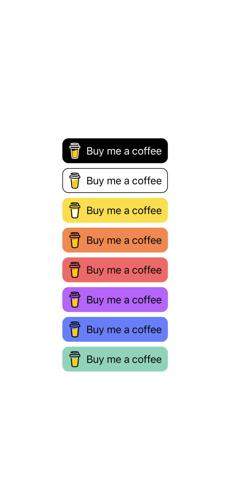
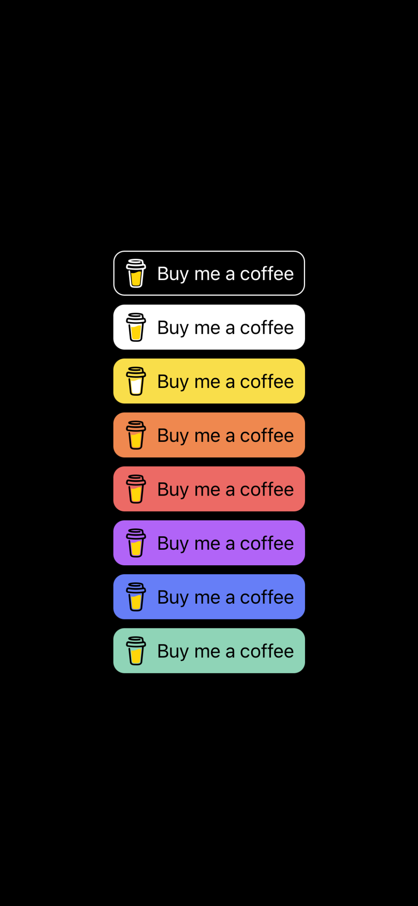

# swiftui-buymeacoffee

A package containing a Buy Me a Coffee button for Apple's SwiftUI framework.

## Overview

Light Mode | Dark Mode
:---:|:---:
 | 

## Availability

- iOS 15.0+
- iPadOS 15.0+

## Installation

The Swift Package Manager is a tool for managing the distribution of Swift code and is integrated into the swift compiler.

1. Add the package to the dependencies in your `Package.swift` file.

    ```swift
    let package: Package = .init(
        ...
        dependencies: [
            .package(url: "https://github.com/alexandrehsaad/swiftui-buymeacoffee.git", branch: "main")
        ],
        ...
    )
    ```

2. Add the package as a dependency on your target in your `Package.swift` file.

    ```swift
    let package: Package = .init(
        ...
        targets: [
            .target(name: "MyTarget", dependencies: [
                .product(name: "BuyMeACoffee", package: "swiftui-buymeacoffee")
            ]),
        ],
        ...
    )
    ```

3. Import the package in your source code.

    ```swift
    import BuyMeACoffee
    ```

## Demonstration
    
1. Apply the standard interaction behavior and appearance.

    ```swift
    ...
    BuyMeACoffeeButton(username: "myusername")
        .buttonStyle(BuyMeACoffeeButtonStyle(tint: .yellow))
    ...
    ```
    
2. Configure the button to display an icon, a label, or both.

    ```swift
    ...
    BuyMeACoffeeButton(username: "myusername")
        .labelStyle(.titleAndIcon)
    ...
    ```
    
## Examples

An example of a button that adapts to the color scheme.

    ```swift
    struct ContentView: View {
        @Environment(\.colorScheme)
        var colorScheme
		
        var backgroundColor: BuyMeACoffeeColor {
            colorScheme == .dark ? .black : .white
        }
		
        var strokeColor: Color {
            colorScheme == .dark ? .white : .black
        }
		
        var body: some View {
            BuyMeACoffeeButton(username: "myusername")
                .buttonStyle(BuyMeACoffeeButtonStyle(tint: backgroundColor))
                .cornerRadius(10)
                .overlay(RoundedRectangle(cornerRadius: 10)
                    .strokeBorder(strokeColor, lineWidth: 1)
                )
        }
    }
    ```

## Documentation

You can read more about this package by visiting the [documentation page].

## Contribution

Contributions are what makes the open source community such an amazing place to learn, inspire, and create. If you wish to contribute and be part of this project, please fork the repository and create a [pull request].

1. Fork the repository
2. Create your feature branch `git checkout -b feature/NewFeature`
3. Commit your changes `git commit -m 'Added a new feature'`
4. Push to your branch `git push origin feature/NewFeature`
5. Open a pull request

### Reporting a bug

If you find a bug, please create an [issue].

### Contacting the maintainers

If you want to share your thoughts on how to improve this repository, you can contact the code owner. See the `CODEOWNERS.text` file for more information.

### Supporting this repository

If this repository has been useful to you in some way, show your support by starring it.

## Code of Conduct

To be a truly great community, we welcome developers from all walks of life, with different backgrounds, and with a wide range of experience. A diverse and friendly community will have more great ideas, more unique perspectives, and produce more great code. We will work diligently to make this community welcoming to everyone. See the `CODEOFCONDUCT.md` file for more information.

## License

Distributed under Apache License v2.0 with Runtime Library Exception. See the `LICENSE.md` file for more information.

[documentation page]: https://alexandrehsaad.github.io/swiftui-buymeacoffee/documentation/buymeacoffee
[pull request]: https://github.com/alexandrehsaad/swiftui-buymeacoffee/pulls
[issue]: https://github.com/alexandrehsaad/swiftui-buymeacoffee/issues

## Credits

The button icon is copyright © Buy Me a Coffee.
